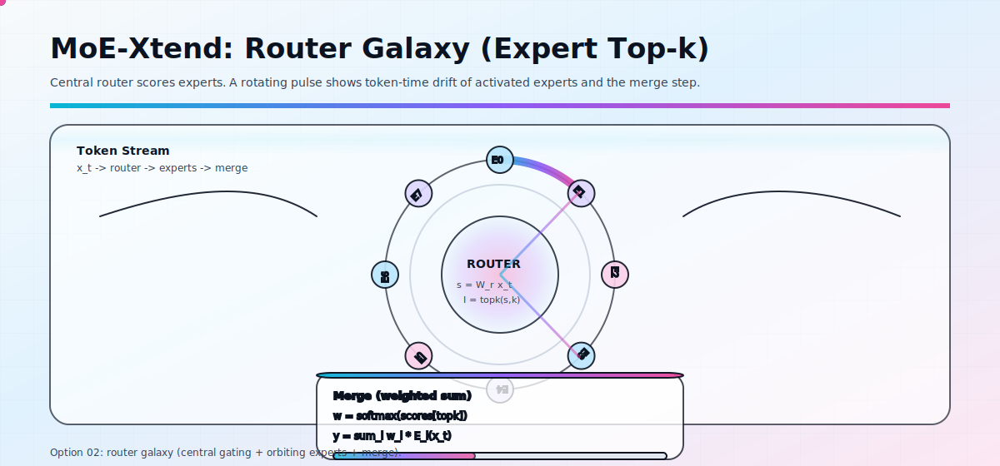

<div align="center">
  
</div>

<h1 align="center">MoE-Xtend</h1>

<p align="center"><strong>Context Unbound. Intelligence Unleashed.</strong></p>

<p align="center">
  
  
  
  
  
</p>

<p align="center">
  <strong>All visuals are local</strong> (no external URLs). <strong>SVG-first</strong> with GitHub-safe animations. <strong>Researcher-focused</strong>: shapes, formulas, failure modes.
</p>

---

<h2 align="center">CONTENTS</h2>

- [Overview](#overview)
- [Design Contracts](#design-contracts)
- [Quick Start](#quick-start)
- [CLI Examples](#cli-examples)
- [Responses API (Local)](#responses-api-local)
- [System Flow](#system-flow)
- [Architecture](#architecture)
- [Token Stream (Decode)](#token-stream-decode)
- [MoE Routing](#moe-routing)
- [Attention Stack](#attention-stack)
- [RoPE + Scaling](#rope--scaling)
- [KV Cache](#kv-cache)
- [Sampling Controls](#sampling-controls)
- [Core Formulas](#core-formulas)
- [Evaluation](#evaluation)
- [Determinism + Debugging](#determinism--debugging)
- [Notation](#notation)
- [Repository Layout](#repository-layout)
- [Roadmap](#roadmap)

---

<h2 id="overview" align="center">OVERVIEW</h2>

MoE-Xtend is a **long-context MoE transformer system spec** with a heavy emphasis on:

- **Sparse compute, dense capacity** via top-k expert routing.
- **Long-context stability** via RoPE scaling (YaRN + NTK-by-parts) and explicit mask engineering.
- **Transparent inference** via deterministic sampling controls, logprobs, and regression-minded metrics.
- **Readable math**: every major component is paired with formulas and diagrams.

<div align="center">
  
</div>

<details>
  <summary><strong>Alternate overview hero variants</strong></summary>
  <br/>
  
  
  
  
</details>

**How to read the blueprint**

1. **Harmony prompt**: structured messages render into a deterministic token stream.
2. **Tokenizer + masks**: ids, attention masks, and absolute positions are built once per request.
3. **Transformer stack**: alternating full/banded attention blocks and sparse MoE blocks.
4. **KV cache discipline**: prefill writes a prefix once; decode appends one row per token.
5. **Sampling + stop logic**: logits -> truncation -> multinomial/greedy -> termination.
6. **Structured outputs**: optional JSON extraction + schema checks for regression loops.

**One-page pseudocode (prefill + decode)**

```text
# Prefill: build cache from prompt tokens once
tokens = tokenize(prompt)
cache = init_cache(L, B, cache_size=min(len(tokens) + max_tokens, max_context))
X = embed(tokens)
for l in 0..L-1:
  X = Block[l].forward(X, cache[l])  # writes K/V and advances cache[l].offset

# Decode: append one token per step (absolute position = cache.offset)
for step in 0..max_tokens-1:
  x = X[:, -1:]                      # last token only
  for l in 0..L-1:
    x = Block[l].forward(x, cache[l])  # appends 1 KV row per layer
  next = sample(x)
  X = concat(X, embed(next))
```

**What you can do with this repo**

- Run Harmony-native inference with strict sampling controls and measurable metrics (`inference.py`).
- Serve a minimal Responses-style endpoint for local integration tests (`server.py`).
- Stress long-context retrieval quickly with eval scripts (`evals/`).
- Use the diagrams as a technical spec that matches the implementation (this `README.md` + `assets/`).

The repo includes:

- `assets/`: all diagrams/animations (local, GitHub-safe)
- `inference.py`: Harmony-native inference + sampling + metrics/logprobs
- `server.py`: local Responses-style HTTP server
- `evals/`: retrieval + long-context sanity checks

---

<h2 id="design-contracts" align="center">DESIGN CONTRACTS</h2>

If you change anything in the stack, keep these invariants intact or you will get silent long-context failures:

- **Absolute position monotonicity**: RoPE positions use the global index `t = cache.offset + local_t` (never reset per window).
- **Mask alignment**: causal/window masks must be built against `n_ctx = cache.K.shape[1]` with the same `offset` used for RoPE.
- **KV cache append-only**: decode adds exactly one row per layer per step; `offset` increments once per append.
- **GQA shape contract**: `H_q = H_kv * groups` and `head_dim` must match the checkpoint; don't "fix" mismatches downstream.
- **MoE routing determinism**: `topk` ties, dtype, and device kernels can change expert selection. For regression: log routing ids.
- **Sampling determinism**: seed + truncation params + penalties define behavior. If you change them, treat it as a new experiment.

Where this is enforced in code:

- `model.py`: `AttentionBlock.sdpa` (mask alignment + sinks), `RotaryEmbedding.forward` (absolute positions), `Cache.extend` (append-only)
- `model.py`: `MLPBlock.forward` (router logits + top-k expert execution)
- `sampling.py`: truncation + penalties + multinomial

---

<h2 id="quick-start" align="center">QUICK START</h2>

**Requirements**

- Python 3.9+
- A checkpoint directory containing `config.json` and `*.safetensors`

**Install**

```bash
python3 -m venv .venv
source .venv/bin/activate
pip install -r requirements.txt
```

Optional (GPU kernels):

```bash
pip install -r requirements-gpu.txt
```

**Set checkpoint**

```bash
export MOE_XTEND_CHECKPOINT=/path/to/checkpoint
```

Expected checkpoint layout:

- `config.json`
- one or more `*.safetensors` files

**Run inference**

```bash
python3 inference.py \
  --checkpoint "$MOE_XTEND_CHECKPOINT" \
  --format harmony \
  --prompt "Design a scheduling agent." \
  --max_tokens 256
```

**Run local server**

```bash
python3 server.py --checkpoint "$MOE_XTEND_CHECKPOINT" --port 8000
```

**Run evals**

```bash
python3 evals/needle_haystack.py --checkpoint "$MOE_XTEND_CHECKPOINT"
python3 evals/passkey_retrieval.py --checkpoint "$MOE_XTEND_CHECKPOINT"
```

---

<h2 id="cli-examples" align="center">CLI EXAMPLES</h2>

**1) Multi-sample with shared prefill**

Prefill once, then decode multiple samples by restoring KV snapshots (fast for research sweeps):

```bash
python3 inference.py \
  --checkpoint "$MOE_XTEND_CHECKPOINT" \
  --format harmony \
  --prompt "Summarize MoE routing in 6 bullets." \
  --num_samples 4 \
  --max_tokens 180
```

**2) Logprobs + JSONL output (regression-friendly)**

```bash
python3 inference.py \
  --checkpoint "$MOE_XTEND_CHECKPOINT" \
  --format harmony \
  --prompt "Return a JSON object with keys: title, risks, mitigations." \
  --max_tokens 220 \
  --logprobs \
  --logprobs_json logprobs.jsonl \
  --output_json outputs.jsonl
```

**3) Extract JSON from model output**

```bash
python3 inference.py \
  --checkpoint "$MOE_XTEND_CHECKPOINT" \
  --format harmony \
  --prompt "Output ONLY valid JSON: {\\\"answer\\\": string, \\\"confidence\\\": number}." \
  --max_tokens 120 \
  --extract_json \
  --json_output extracted.json
```

**4) Validate extracted JSON against a schema**

```bash
python3 inference.py \
  --checkpoint "$MOE_XTEND_CHECKPOINT" \
  --format harmony \
  --prompt "Output ONLY valid JSON: {\\\"answer\\\": string, \\\"confidence\\\": number}." \
  --max_tokens 120 \
  --extract_json \
  --json_schema schema.json \
  --json_output extracted.json
```

---

<h2 id="responses-api-local" align="center">RESPONSES API (LOCAL)</h2>

Start the server:

```bash
python3 server.py --checkpoint "$MOE_XTEND_CHECKPOINT" --port 8000
```

Example request (messages):

```bash
curl -s http://127.0.0.1:8000/v1/responses \
  -H 'Content-Type: application/json' \
  -d @- <<'JSON' | python3 -m json.tool
{
  "messages": [
    {"role": "system", "content": "You are a precise research assistant."},
    {"role": "user", "content": "Explain top-k MoE routing."}
  ],
  "temperature": 0.2,
  "max_output_tokens": 200,
  "top_p": 0.95,
  "min_p": 0.05
}
JSON
```

Example request (input):

```bash
curl -s http://127.0.0.1:8000/v1/responses \
  -H 'Content-Type: application/json' \
  -d '{"input":"Summarize KV cache update rules.","max_output_tokens":120,"temperature":0.1}' \
  | python3 -m json.tool
```

Response shape:

```json
{
  "output_text": "...",
  "metrics": {
    "prefill_ms": 0.0,
    "decode_ms": 0.0,
    "tokens_generated": 0
  }
}
```

Notes:

- Stop tokens include Harmony `return` and `call` markers.
- `logit_bias` supports either a JSON object or `token_id:bias,...`.
- This server is intentionally minimal: it is meant for local testing and profiling loops.

---

<h2 id="system-flow" align="center">SYSTEM FLOW</h2>


**High-level loop**

1. Harmony formatting builds structured prompts.
2. Tokenization produces ids + masks.
3. The stack alternates **attention** and **MoE** blocks.
4. KV cache is built at prefill, then appended during decode.
5. Sampling converts logits into a stable next-token choice.

---

<h2 id="architecture" align="center">ARCHITECTURE</h2>


**Prefill vs decode**

- Prefill writes the prompt KV once. In full-attention layers, this is where the `O(T^2)` work lives.
- Decode is a single-token loop: append KV at `offset=t`, then `t++`. With sliding window layers, per-step attention becomes `O(W)`.

---

<h2 id="token-stream-decode" align="center">TOKEN STREAM (DECODE)</h2>


**Decode invariants**

- One token per step.
- KV cache is append-only.
- Absolute position matters: RoPE uses the global token index `t` (not local window index).

---

<h2 id="moe-routing" align="center">MOE ROUTING</h2>


**Canonical equations**

Let the token hidden state be `x_t`.

$$s = W_r x_t$$
$$I = \mathrm{topk}(s, k)$$
$$w = \mathrm{softmax}(s[I])$$
$$y = \sum_{i \in I} w_i \cdot E_i(x_t)$$

**Dispatch + combine (batched view)**

For a batch with `N = B*T` token states and `E` experts:

```text
S = X @ W_r^T                 # [N, E] router logits
I = topk(S, k)                # [N, k] expert ids per token
w = softmax(gather(S, I))     # [N, k] normalized weights

# Dispatch: group token indices by expert id
for e in 0..E-1:
  idx = {t | e in I[t, :]}    # token rows routed to expert e
  y[idx] += w[idx, slot] * Expert_e(X[idx])
```

In training systems you often enforce a **capacity** per expert to avoid overflow:

$$C \approx \left\lceil \mathrm{capacity\_factor} \cdot \frac{N \cdot k}{E} \right\rceil$$

This repo does **not** implement capacity or expert-parallel all-to-all. It is clarity-first and single-device.

**Why routing is hard in practice**

- **Collapse**: without balancing pressure, most tokens pick the same experts.
- **Overflow**: with capacity constraints, many tokens may want the same expert at the same time.
- **Non-determinism**: floating-point ties in `topk` can cause unstable outputs unless tie-breaks are consistent.

**Optional (training) stabilization terms**

If you train MoE models, you typically add auxiliary losses to keep routing healthy:

- **Load/importance balancing** (discourages collapse).
- **Router z-loss** (discourages extreme logits).
- **Entropy regularization** (keeps routing distribution from becoming degenerate early).

**Pseudocode (routing)**

```text
# x_t: token hidden state
s = W_r @ x_t
I = topk(s, k)
w = softmax(s[I])

out = 0
for i in I:
  out += w[i] * Expert_i(x_t)
```

**Implementation notes (this repo)**

- `model.py`: `MLPBlock.forward` computes router logits, selects `topk`, normalizes weights, and evaluates only the selected experts via batched `einsum`.
- No expert-parallel all-to-all and no capacity enforcement. This is clarity-first, not a fused-kernel implementation.
- If you are comparing runs: `topk` ties + dtype can change routing, which changes everything downstream.

---

<h2 id="attention-stack" align="center">ATTENTION STACK</h2>


**Attention equation**

$$A = \mathrm{softmax}\left(\frac{QK^T}{\sqrt{d}} + B\right), \quad Y = AV$$

Where `B` decomposes into additive bias terms:

- Causal mask
- Sliding window mask (for windowed layers)
- Sink bias (to stabilize long decode)

**Mask engineering (prefill vs decode, aligned to KV cache)**

Let `offset` be the number of cached prefix tokens (0 for prefill, >0 for decode). For a query row `q` in the current chunk and a key index `k` in the cache:

$$\mathrm{causal}(q,k) =
\\begin{cases}
0 & k \\le (\\mathrm{offset} + q) \\\\
-\\infty & \\text{otherwise}
\\end{cases}$$

Sliding window (banded) attention of width `W` adds a lower bound:

$$\mathrm{window}(q,k) =
\\begin{cases}
0 & k \\ge (\\mathrm{offset} + q - W) \\\\
-\\infty & \\text{otherwise}
\\end{cases}$$

When these two masks are wrong by even one index, long-context behavior becomes chaotic (the model either "sees the future" or loses its anchor).

**Sink bias (what this repo implements)**

This implementation appends a **learnable sink logit** per head as an extra softmax column, then drops that column after normalization:

$$W = \\mathrm{softmax}([QK + B,\\; S])$$

Dropping `W_{sink}` leaves a "leaky" normalization that can damp attention mass in a head-specific way without changing the KV cache layout.

**Pseudocode (attention + GQA, schematic)**

```text
Q = X @ W_q
K = X @ W_k
V = X @ W_v

# grouped query attention: many Q heads share fewer KV heads
Q = reshape(Q, Hq, d)
K = reshape(K, Hkv, d)
V = reshape(V, Hkv, d)

B = causal_mask + window_mask + sink_bias
A = softmax((Q K^T)/sqrt(d) + B)
Y = A @ V
```

**Implementation notes (this repo)**

- `model.py`: `AttentionBlock.sdpa` constructs masks aligned to KV offset and appends a per-head sink bias as an extra softmax column.
- Sliding window is applied on alternating layers (`layer_idx % 2 == 0`) to mix dense and banded patterns.
- The easiest long-context bug is an off-by-one diagonal in the causal/window mask when switching prefill -> decode.

---

<h2 id="rope--scaling" align="center">ROPE + SCALING</h2>


**Base RoPE schedule**

$$\theta_i = b^{-2i/d}$$
$$\lambda_i = \frac{2\pi}{\theta_i}$$

**NTK-by-parts ratio**

$$r(i) = \frac{L \cdot \theta_i}{2\pi}$$

Interpretation:

- Fast clocks preserve local detail.
- Slow clocks preserve long-range structure.
- Mid-band blends regimes to avoid phase discontinuities.

**Pseudocode (YaRN + NTK-by-parts, matches this repo)**

In `model.py`, the rotary coefficients are built from "inverse frequencies" `inv_freqs[i]` plus a YaRN concentration term:

```text
freqs[i] = base^(i / (d/2))          # geometric progression (per pair index)
extrapolation = 1 / freqs            # original RoPE
interpolation = 1 / (s * freqs)      # position interpolation (context stretch by s)

concentration = 0.1 * log(s) + 1.0   # YaRN temperature softening

# Cutpoints in index-space (i_beta < i_alpha):
i_beta  = (d/2) * log(L_train / (beta * 2pi))  / log(base)
i_alpha = (d/2) * log(L_train / (alpha * 2pi)) / log(base)

ramp = (arange(d/2) - i_beta) / (i_alpha - i_beta)
mask = 1 - clamp(ramp, 0, 1)         # 1 in FAST region, 0 in SLOW region

inv_freqs = interpolation * (1 - mask) + extrapolation * mask
cos/sin = cos(t * inv_freqs) * concentration, sin(t * inv_freqs) * concentration
```

This produces 3 regimes: fast clocks stay unchanged, slow clocks are stretched, and the middle band blends smoothly.

**Implementation notes (this repo)**

- `model.py`: `RotaryEmbedding` precomputes `cos/sin` up to `max_content_length` and indexes with `(arange(seq_len) + offset) % max_content_length`.
- YaRN concentration is applied by scaling `cos/sin` (softens attention temperature as length grows).
- NTK-by-parts modifies inverse frequencies using alpha/beta cutpoints and a linear ramp blend.

---

<h2 id="kv-cache" align="center">KV CACHE</h2>


**Memory scaling**

A useful back-of-the-envelope estimator:

$$\mathrm{bytes} \approx 2 \cdot L \cdot B \cdot T \cdot H_{kv} \cdot d \cdot \mathrm{dtype\_bytes}$$

- The factor `2` is for `K` and `V`.
- GQA reduces `H_kv`.
- Long contexts make `T` the dominant term.
- `dtype_bytes` is bytes per element (2 for bf16/fp16, 4 for fp32).

Example (bf16 KV, `dtype_bytes=2`):

$$\\mathrm{bytes} \\approx 2 \\cdot 24 \\cdot 1 \\cdot 131072 \\cdot 8 \\cdot 64 \\cdot 2 \\approx 6.0\\,\\mathrm{GiB}$$

**Implementation notes (this repo)**

- `model.py`: `Cache.extend` writes new K/V into preallocated tensors at indices `[offset:offset+t]`, then increments `offset`.
- `model.py`: `Cache.snapshot()` / `Cache.restore()` enable "prefill once, decode many" research loops.
- `inference.py`: caches are allocated per layer sized to `min(len(prompt)+max_tokens, max_context)`.
- If you see shape mismatches or attention weirdness, check: KV head count (`H_kv`), `head_dim`, and the cache `offset`.

---

<h2 id="sampling-controls" align="center">SAMPLING CONTROLS</h2>


**Core sampling relations**

$$p = \mathrm{softmax}(z/T)$$

- **Top-k**: keep k highest probability tokens.
- **Top-p**: keep smallest set with cumulative probability >= p.
- **Min-p**: drop tokens with probability below a fraction of the max token probability.

**Implementation notes (this repo)**

- `sampling.py` applies `logit_bias`, repetition/presence/frequency penalties, then truncation (`top_k`, `top_p`, `min_p`), then samples.
- Set `temperature=0` for greedy decode; otherwise sampling uses `torch.multinomial`.

---

<h2 id="core-formulas" align="center">CORE FORMULAS</h2>


For a searchable ASCII reference inside SVG, see:


---

<h2 id="evaluation" align="center">EVALUATION</h2>


Recommended eval axes:

- Context length sweep (where do failures start?)
- Retrieval depth sweep (needle/passkey)
- TTFT distribution (p50/p95)
- Tokens/sec steady-state decode
- Regression tests on logprobs and structured outputs

---

<h2 id="determinism--debugging" align="center">DETERMINISM + DEBUGGING</h2>

If you want stable, comparable runs, treat determinism as a feature:

- Fix seeds and record every sampling parameter.
- Use stable `topk` tie-breaks.
- Prefer deterministic kernels when comparing regression outputs.
- Log `logprobs`, selected experts, and KV cache offsets.

Common long-context failure modes:

- Wrong absolute position indexing (RoPE mismatch between prefill and decode)
- Mask bugs (off-by-one in window, sinks applied to wrong tokens)
- KV cache layout mismatch (stride / head grouping)
- MoE capacity overflow (silent drops -> accuracy cliff)

---

<h2 id="notation" align="center">NOTATION</h2>

- `B`: batch size
- `T`: sequence length (time)
- `L`: transformer layers
- `H_q`: query heads
- `H_kv`: key/value heads (GQA)
- `d`: head dimension
- `W`: sliding window size
- `E`: number of experts
- `k`: experts per token (top-k routing)

**Shape conventions**

- Hidden states: `[B, T, hidden_size]`
- Cache per layer: `K,V: [B, T_cache, H_kv, d]`
- GQA grouping: `H_q = H_kv * groups`

---

<h2 id="repository-layout" align="center">REPOSITORY LAYOUT</h2>

```text
assets/                    # diagrams + animated SVGs (local)
evals/                     # long-context eval scripts
inference.py               # inference + sampling + logprobs/metrics
model.py                   # transformer + MoE + RoPE + KV cache
prompting.py               # Harmony message rendering helpers
sampling.py                # top-k/top-p/min-p + penalties
server.py                  # Responses-style local HTTP server
weights.py                 # safetensors checkpoint loader (MXFP4 decode)
requirements.txt
requirements-gpu.txt
requirments.txt            # compat shim (typo), includes requirements.txt
LICENSE
README.md
```

---

<h2 id="roadmap" align="center">ROADMAP</h2>

- Kernel-level optimizations (Triton attention, fused MoE dispatch/merge).
- Quantization-aware long-context runs (bandwidth first: KV + dequant).
- Long-context calibration sweeps with automated reporting.
- Expanded evals (instruction-following, tool use, structured extraction).

---

## License
MIT. See `LICENSE` for details.
