<div align="center">
  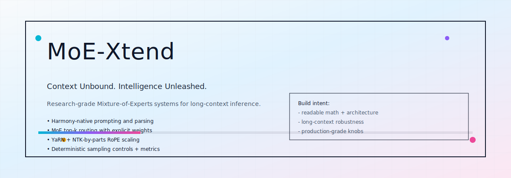
</div>

<h1 align="center">MoE-Xtend</h1>

<p align="center"><strong>Context Unbound. Intelligence Unleashed.</strong></p>

<p align="center">
  
  
  
  
  
</p>

<p align="center">
  <strong>All visuals are local</strong> (no external URLs). <strong>SVG-first</strong> with GitHub-safe animations. <strong>Researcher-focused</strong>: shapes, formulas, failure modes.
</p>

---

<h2 align="center">CONTENTS</h2>

- [Overview](#overview)
- [Quick Start](#quick-start)
- [System Flow](#system-flow)
- [Architecture](#architecture)
- [Token Stream (Decode)](#token-stream-decode)
- [MoE Routing](#moe-routing)
- [Attention Stack](#attention-stack)
- [RoPE + Scaling](#rope--scaling)
- [KV Cache](#kv-cache)
- [Sampling Controls](#sampling-controls)
- [Core Formulas](#core-formulas)
- [Evaluation](#evaluation)
- [Determinism + Debugging](#determinism--debugging)
- [Repository Layout](#repository-layout)
- [Roadmap](#roadmap)

---

<h2 id="overview" align="center">OVERVIEW</h2>

MoE-Xtend is a **long-context MoE transformer system spec** with a heavy emphasis on:

- **Sparse compute, dense capacity** via top-k expert routing.
- **Long-context stability** via RoPE scaling (YaRN + NTK-by-parts) and explicit mask engineering.
- **Transparent inference** via deterministic sampling controls, logprobs, and regression-minded metrics.
- **Readable math**: every major component is paired with formulas and diagrams.

The repo includes:

- `assets/`: all diagrams/animations (local, GitHub-safe)
- `inference.py`: Harmony-native inference + sampling + metrics/logprobs
- `server.py`: local Responses-style HTTP server
- `evals/`: retrieval + long-context sanity checks

---

<h2 id="quick-start" align="center">QUICK START</h2>

**Install**

```bash
python3 -m venv .venv
source .venv/bin/activate
pip install -r requirements.txt
```

Optional (GPU kernels):

```bash
pip install -r requirements-gpu.txt
```

**Set checkpoint**

```bash
export MOE_XTEND_CHECKPOINT=/path/to/checkpoint
```

Expected checkpoint layout:

- `config.json`
- one or more `*.safetensors` files

**Run inference**

```bash
python3 inference.py \
  --checkpoint "$MOE_XTEND_CHECKPOINT" \
  --format harmony \
  --prompt "Design a scheduling agent." \
  --max_tokens 256
```

**Run local server**

```bash
python3 server.py --checkpoint "$MOE_XTEND_CHECKPOINT" --port 8000
```

**Run evals**

```bash
python3 evals/needle_haystack.py --checkpoint "$MOE_XTEND_CHECKPOINT"
python3 evals/passkey_retrieval.py --checkpoint "$MOE_XTEND_CHECKPOINT"
```

---

<h2 id="system-flow" align="center">SYSTEM FLOW</h2>

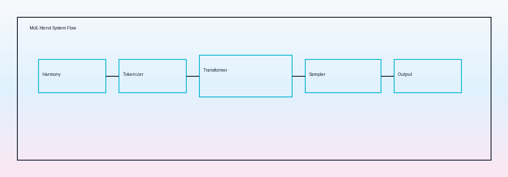

**High-level loop**

1. Harmony formatting builds structured prompts.
2. Tokenization produces ids + masks.
3. The stack alternates **attention** and **MoE** blocks.
4. KV cache is built at prefill, then appended during decode.
5. Sampling converts logits into a stable next-token choice.

---

<h2 id="architecture" align="center">ARCHITECTURE</h2>

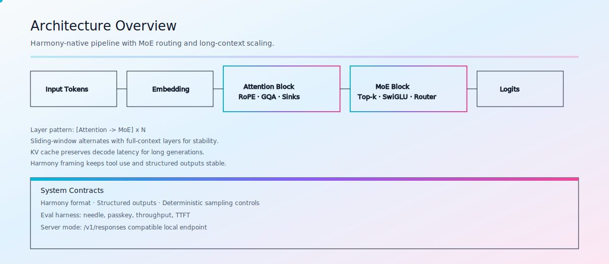

**Prefill vs decode**

- Prefill writes the prompt KV once. In full-attention layers, this is where the `O(T^2)` work lives.
- Decode is a single-token loop: append KV at `offset=t`, then `t++`. With sliding window layers, per-step attention becomes `O(W)`.

---

<h2 id="token-stream-decode" align="center">TOKEN STREAM (DECODE)</h2>

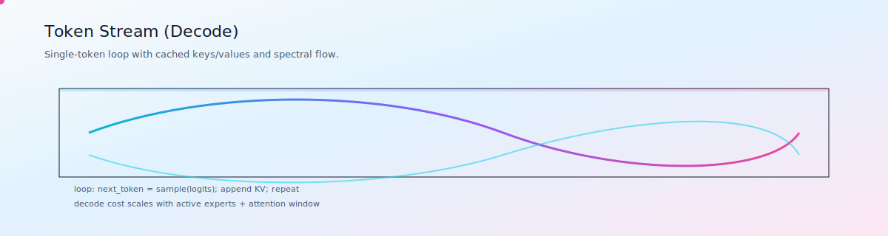

**Decode invariants**

- One token per step.
- KV cache is append-only.
- Absolute position matters: RoPE uses the global token index `t` (not local window index).

---

<h2 id="moe-routing" align="center">MOE ROUTING</h2>


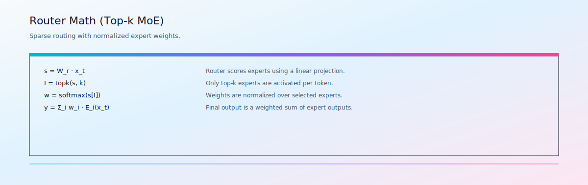

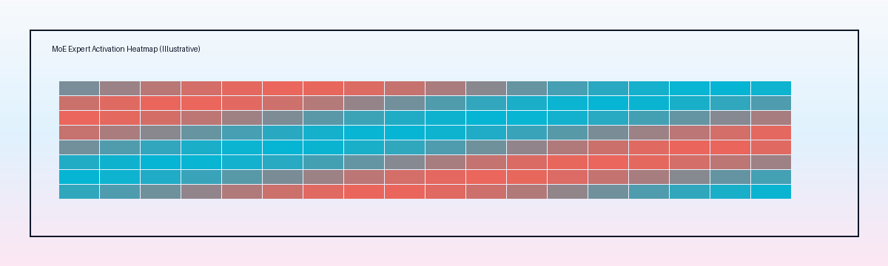


**Canonical equations**

Let the token hidden state be `x_t`.

$$s = W_r x_t$$
$$I = \mathrm{topk}(s, k)$$
$$w = \mathrm{softmax}(s[I])$$
$$y = \sum_{i \in I} w_i \cdot E_i(x_t)$$

**Why routing is hard in practice**

- **Collapse**: without balancing pressure, most tokens pick the same experts.
- **Overflow**: with capacity constraints, many tokens may want the same expert at the same time.
- **Non-determinism**: floating-point ties in `topk` can cause unstable outputs unless tie-breaks are consistent.

**Pseudocode (routing)**

```text
# x_t: token hidden state
s = W_r @ x_t
I = topk(s, k)
w = softmax(s[I])

out = 0
for i in I:
  out += w[i] * Expert_i(x_t)
```

---

<h2 id="attention-stack" align="center">ATTENTION STACK</h2>


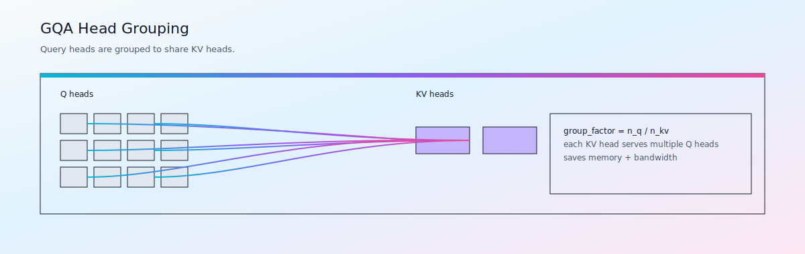


**Attention equation**

$$A = \mathrm{softmax}\left(\frac{QK^T}{\sqrt{d}} + B\right), \quad Y = AV$$

Where `B` decomposes into additive bias terms:

- Causal mask
- Sliding window mask (for windowed layers)
- Sink bias (to stabilize long decode)

**Pseudocode (attention + GQA, schematic)**

```text
Q = X @ W_q
K = X @ W_k
V = X @ W_v

# grouped query attention: many Q heads share fewer KV heads
Q = reshape(Q, Hq, d)
K = reshape(K, Hkv, d)
V = reshape(V, Hkv, d)

B = causal_mask + window_mask + sink_bias
A = softmax((Q K^T)/sqrt(d) + B)
Y = A @ V
```

---

<h2 id="rope--scaling" align="center">ROPE + SCALING</h2>

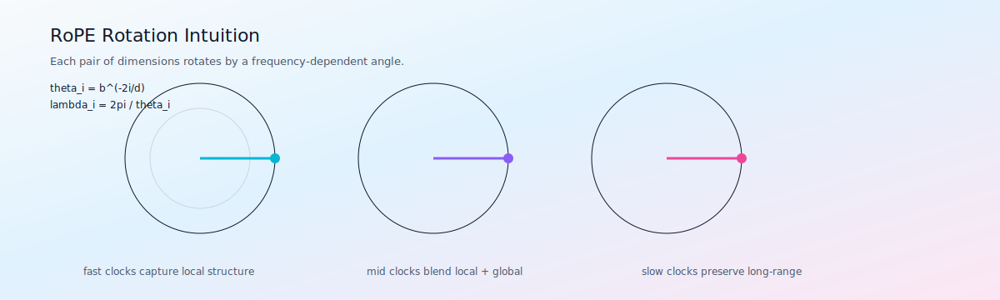


**Base RoPE schedule**

$$\theta_i = b^{-2i/d}$$
$$\lambda_i = \frac{2\pi}{\theta_i}$$

**NTK-by-parts ratio**

$$r(i) = \frac{L \cdot \theta_i}{2\pi}$$

Interpretation:

- Fast clocks preserve local detail.
- Slow clocks preserve long-range structure.
- Mid-band blends regimes to avoid phase discontinuities.

---

<h2 id="kv-cache" align="center">KV CACHE</h2>

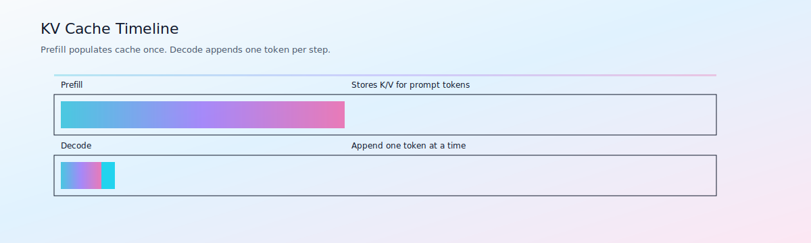

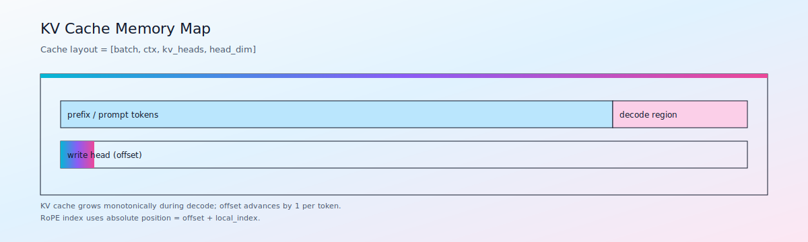

**Memory scaling**

A useful back-of-the-envelope estimator:

$$\text{bytes} \approx 2 \cdot L \cdot B \cdot T \cdot H_{kv} \cdot d \cdot \text{dtype\_size}$$

- The factor `2` is for `K` and `V`.
- GQA reduces `H_kv`.
- Long contexts make `T` the dominant term.

---

<h2 id="sampling-controls" align="center">SAMPLING CONTROLS</h2>


**Core sampling relations**

$$p = \mathrm{softmax}(z/T)$$

- **Top-k**: keep k highest probability tokens.
- **Top-p**: keep smallest set with cumulative probability >= p.
- **Min-p**: drop tokens with probability below a fraction of the max token probability.

---

<h2 id="core-formulas" align="center">CORE FORMULAS</h2>

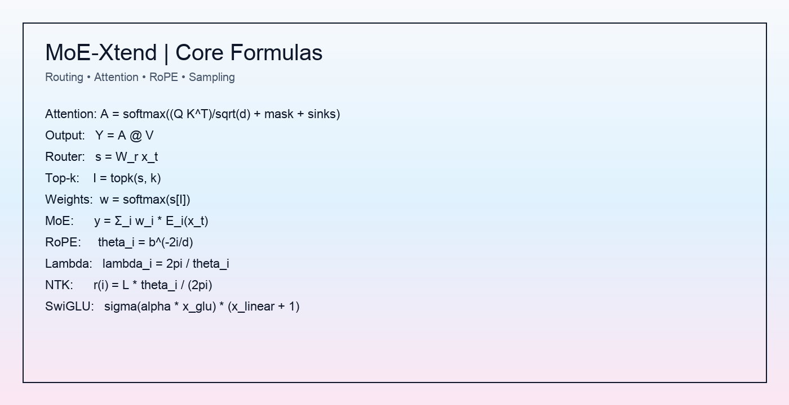

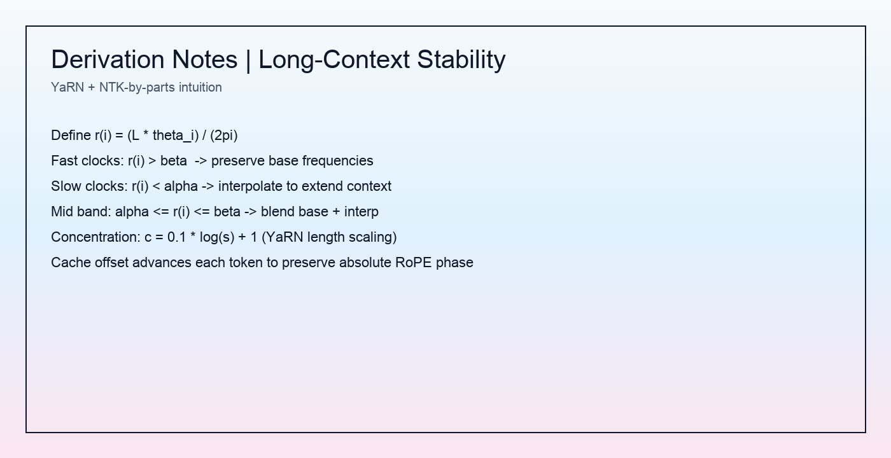

For a searchable ASCII reference inside SVG, see:


---

<h2 id="evaluation" align="center">EVALUATION</h2>


Recommended eval axes:

- Context length sweep (where do failures start?)
- Retrieval depth sweep (needle/passkey)
- TTFT distribution (p50/p95)
- Tokens/sec steady-state decode
- Regression tests on logprobs and structured outputs

---

<h2 id="determinism--debugging" align="center">DETERMINISM + DEBUGGING</h2>

If you want stable, comparable runs, treat determinism as a feature:

- Fix seeds and record every sampling parameter.
- Use stable `topk` tie-breaks.
- Prefer deterministic kernels when comparing regression outputs.
- Log `logprobs`, selected experts, and KV cache offsets.

Common long-context failure modes:

- Wrong absolute position indexing (RoPE mismatch between prefill and decode)
- Mask bugs (off-by-one in window, sinks applied to wrong tokens)
- KV cache layout mismatch (stride / head grouping)
- MoE capacity overflow (silent drops -> accuracy cliff)

---

<h2 id="repository-layout" align="center">REPOSITORY LAYOUT</h2>

```text
assets/                    # diagrams + animated SVGs (local)
evals/                     # long-context eval scripts
inference.py               # inference + sampling + logprobs/metrics
model.py                   # transformer + MoE + RoPE + KV cache
prompting.py               # Harmony message rendering helpers
sampling.py                # top-k/top-p/min-p + penalties
server.py                  # Responses-style local HTTP server
weights.py                 # safetensors checkpoint loader (MXFP4 decode)
requirements.txt
requirements-gpu.txt
requirments.txt            # compat shim (typo), includes requirements.txt
LICENSE
README.md
```

---

<h2 id="roadmap" align="center">ROADMAP</h2>

- Kernel-level optimizations (Triton attention, fused MoE dispatch/merge).
- Quantization-aware long-context runs (bandwidth first: KV + dequant).
- Long-context calibration sweeps with automated reporting.
- Expanded evals (instruction-following, tool use, structured extraction).

---

## License
MIT. See `LICENSE` for details.
